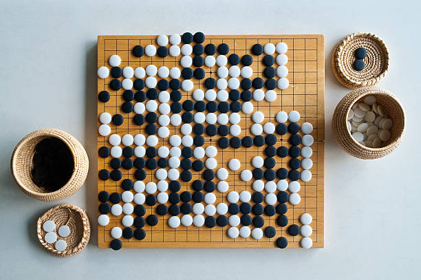

# Go-Engine (kalinixta)

A minimal Go game engine written in C that implements the [Go Text Protocol (GTP)](https://www.lysator.liu.se/~gunnar/gtp/) version 2. It can be used as a backend engine with any GTP-compatible Go GUI (such as GoGui or Sabaki).

## About Go
 
Go is one of the oldest board games in existence, originating in China over 2,500 years ago. Despite its simple rules — players alternate placing black and white stones on a grid, trying to surround more territory than their opponent — it has a staggering depth that has kept it intellectually challenging for millennia. The number of possible board positions on a 19×19 grid vastly exceeds the number of atoms in the observable universe, which is part of why it took until 2016 for AI (DeepMind's AlphaGo) to convincingly defeat a top human professional.
 
The beauty of Go lies in its elegant balance of local and global thinking. Concepts like *sente* (keeping the initiative), *aji* (latent potential in a position), and *life and death* (whether a group can secure two eyes to survive) give the game an almost philosophical richness that players spend lifetimes exploring.
 
.

## Features

- Full GTP v2 interface over stdin/stdout
- Configurable board size (up to 25×25, default 19×19)
- Configurable komi (default 6.5)
- Legal move validation with liberty checking
- Capture detection and group removal
- Basic move generation (`genmove`) — plays the first legal move found
- Territory-based final score calculation (area scoring + komi)
- ASCII board display

## Project Structure

```
Go-Engine/
├── assets/
│   └── go-board.jpg
├── src/
│   ├── main.c
│   └── engine.c
├── goteam.h
├── Makefile
└── README.md
```

## Building

Requirements: `gcc`

```bash
make
```

This produces a static binary called `goteam` in the project root.

To clean build artifacts:

```bash
make clean
```

## Running

```bash
./goteam
```

The engine reads GTP commands from stdin and writes responses to stdout. You can type commands manually or connect it to a GTP-compatible GUI.

## Supported GTP Commands

| Command | Description |
|---|---|
| `protocol_version` | Returns `2` |
| `name` | Returns engine name |
| `version` | Returns `1.0` |
| `known_command <cmd>` | Checks if a command is supported |
| `list_commands` | Lists all supported commands |
| `boardsize <n>` | Sets board size to n×n and clears the board |
| `clear_board` | Resets the board |
| `komi <value>` | Sets komi |
| `play <color> <coord>` | Places a stone (e.g. `play black D4`) |
| `genmove <color>` | Generates and plays a move for the given color |
| `showboard` | Prints an ASCII representation of the board |
| `final_score` | Calculates and prints the final score |
| `quit` | Exits the engine |

### Coordinate Format

Columns use letters `A–Z`, skipping `I` (as is standard in Go). Rows are numbered from 1 at the bottom. Example: `D4`, `Q16`.

Pass moves are supported with the keyword `pass`.

## Scoring

Final score uses **area scoring**: each player's total is their stones on the board plus surrounded empty territory. Komi is added to White's score. The result is printed as `B+X.X` or `W+X.X`.
